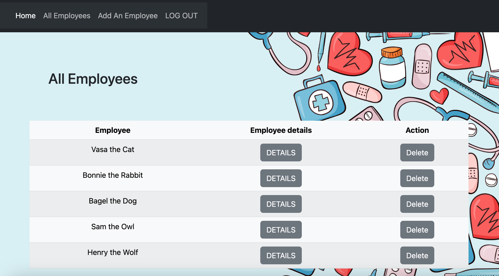

## HR portal App
- This is a healthcare app that allows managers to keep track of their employees. The manager can add new employees, delete employees, edit employees' info and update their nursinf license status. If the manager is out of the office, other managers have access to this info. Any manager who is temporary in charge of said employee can write an annual review. Annual reviews cannot be deleted or edited to allow for transparency and straight record keeping. Users who are not logged in can only see the list of current employees. 

## MVP
- please follow this public Trello link: https://trello.com/b/BcC0XDUQ/project-planning

## Wireframe

## Technlogies Used
- NodeJS & ExpressJS
- MongoDB & MongooseJS ODM
- Authentication using OAuth
- Bootstrap

## Getting Started
- To start using the app, please log in with you Google account. Once logged in you can navigate to the list of the employees, examine employee detail page, edit employee info, add/delete employees to the app, and write annual evaluations as needed. 

## Planned  future enhancements
- Enable user to update employee's title in case of promotion.
- Enable user to update employee's profile picture.

## Image resources
- Image used for the background was taken from the following resource: <a href="https://www.freepik.com/free-vector/hand-drawn-international-nurses-day-background_24436349.htm#query=nurse&position=2&from_view=keyword&track=sph">Freepik</a>